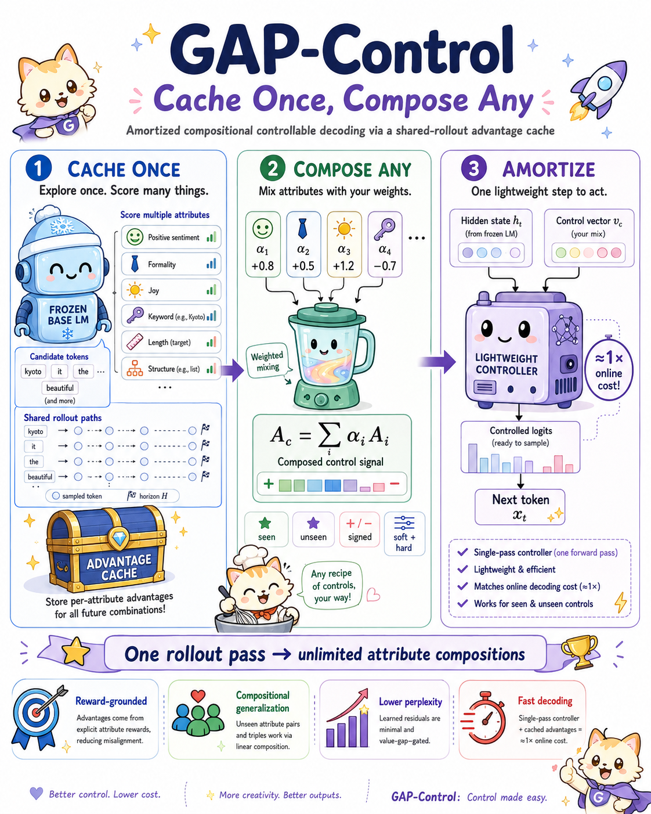
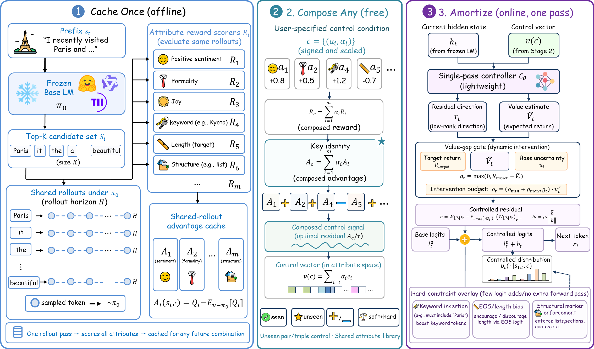
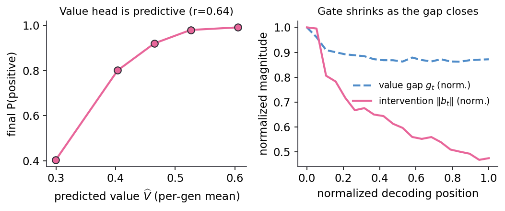
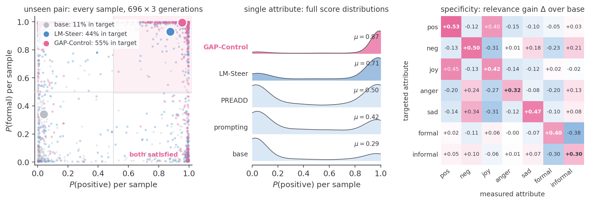
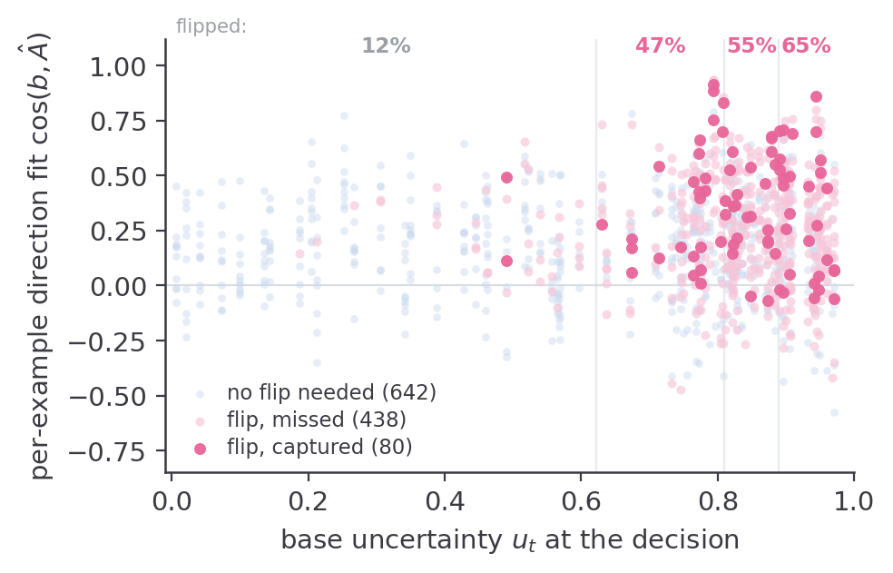
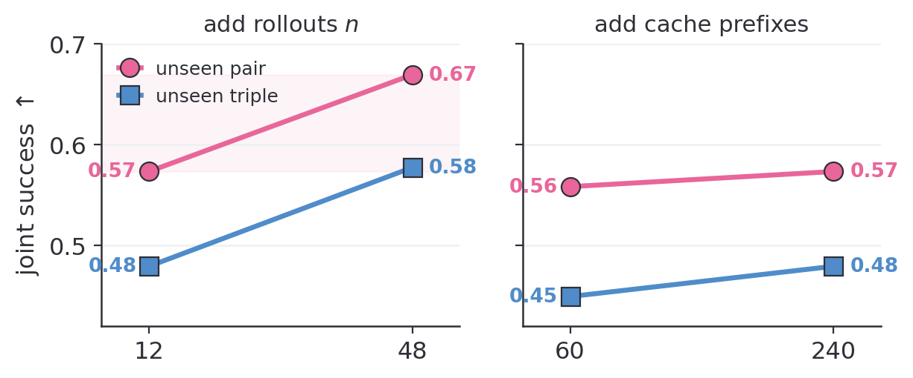
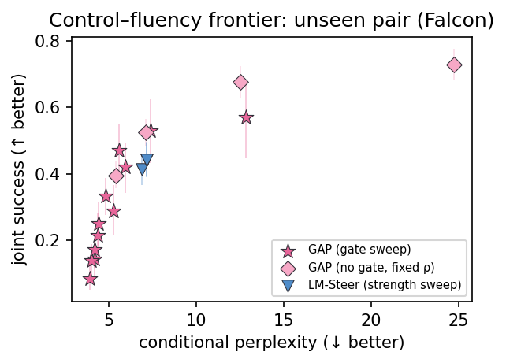
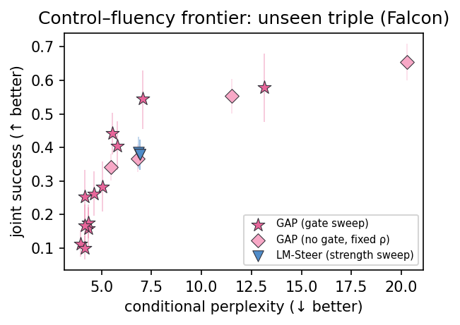
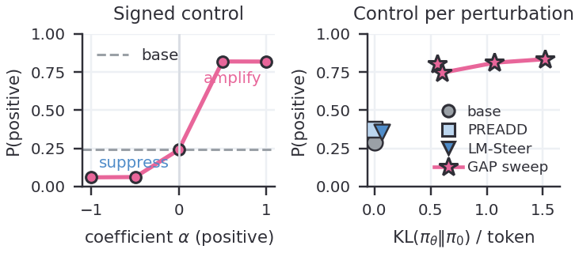
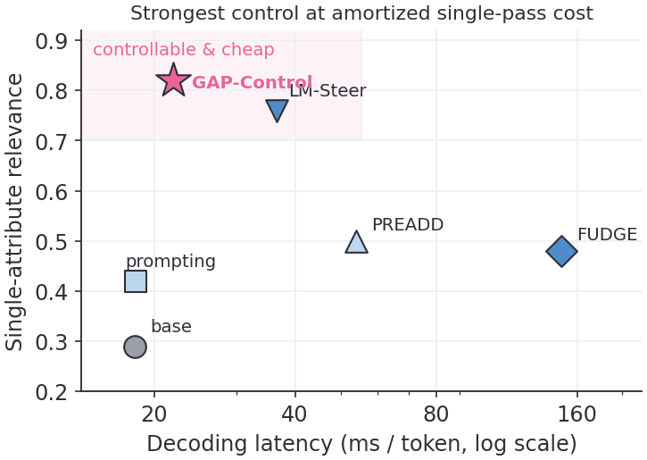

<div align="center">

# GAP-Control

### Composition as Supervision — Amortized Multi-Attribute Control via Shared-Rollout Advantage Distillation



*One offline rollout pass caches every attribute's token-level advantage. Any signed mixture is then an exact linear combination **of the training targets**, distilled into a single-pass controller that decodes at ≈1.2× base cost.*

</div>

---

## Background: why compositional control is stuck

Decoding-time controllable text generation (CTG) steers a **frozen** language model toward target attributes — sentiment, style, emotion, safety — without fine-tuning. Real requests are rarely single-attribute: *"positive, formal, and concise, mentions Paris"*; a safety filter that suppresses toxicity without hurting helpfulness. Each request is a **composition**, often one that was never trained or searched for, and it may carry **signed** weights (amplify some attributes, suppress others).

Two method families dominate, and both break under composition:

- **Amortized steering** (LM-Steer, activation steering) — one forward pass, cheap. But it composes by *adding separately trained vectors*, which is not reward-optimal. We show its compositional control **saturates**: past a moderate strength, more steering buys only perplexity, not joint success.
- **Inference-time search** (FUDGE, twisted SMC, controlled decoding, Best-of-N) — reward-grounded, but **re-runs per target** through particles, candidates, or value estimates. Cost scales with the number of requested compositions, which is combinatorial in the attribute library.

Any method with non-trivial per-condition cost pays per *composition*. The question this project answers: **can the per-attribute work be done once and reused, exactly, for arbitrary signed compositions?**

## The key identity: composition as supervision

The KL-regularized optimal one-step intervention is the reward-induced token-level **advantage**:

$$\pi^\star(v \mid s_t, c) \;\propto\; \pi_0(v \mid s_t)\,\exp\!\big(A_c(s_t,v)/\tau\big).$$

When the reward is a linear mixture $R_c = \sum_i \alpha_i R_i$ evaluated on the **same** continuations, linearity of expectation gives the exact decomposition

$$A_c \;=\; \sum_i \alpha_i A_i , \qquad V_c^\star \;=\; \sum_i \alpha_i V_i^\star ,$$

so one shared-rollout pass per prefix caches the per-attribute advantages $\{\hat A_i\}$ of **all** attributes at once, and the distillation target for **any** condition $c=\{(a_i,\alpha_i)\}$ is a free linear combination of the cache. Suppression is not even a special case: a negative coefficient flips the sign of a cached advantage. Exactness lives in the *training targets* — no per-request rollout, training, or search. That is what we mean by **composition as supervision**.

The story has a second act. The cached targets turn out to be pointwise **noise-dominated** (two independent Monte-Carlo estimates barely agree), and using the cache directly by retrieval is *worse than no control*. Yet the distilled controller reaches the cache's measurable information limit: **distillation is the denoiser** that makes the supervision usable. This predicts — and we confirm by intervention — that control is noise-limited wherever supervision reaches, and generalization-limited only in the doubly novel corner.

## Method: three stages

<div align="center">

</div>

**1 · Cache once** *(offline)* — From each prefix, one shared rollout set ($n$ continuations per top-$K$ candidate) scores *every* atomic reward on the *same* continuations:

$$\hat A_i(s_t,v) = \hat Q_i(s_t,v) - \sum_{u\in S_t}\pi_0(u\mid s_t)\,\hat Q_i(s_t,u), \qquad \hat Q_i(s_t,v)=\tfrac1n\sum_{j} R_i(y^{(j)}).$$

**2 · Compose in supervision** *(free)* — Any signed mixture's target is $\hat A_c = \sum_i \alpha_i \hat A_i$ by the identity above. Training samples random 1–3-attribute signed compositions per prefix, so the controller sees composition *as supervision*.

**3 · Amortize online** *(one pass)* — A small controller $f_\theta(h_t, v(c))$ predicts a tied logit residual $b_t = W_{\mathrm{LM}} r_t$ and a value $\widehat V_t$ from the frozen base hidden state and the control vector $v(c)=\sum_i \alpha_i e_i$. A **value-gap gate** sizes each step:

$$\rho_t = \big(\rho_{\min} + \rho_{\max}\,g_t\big)\,u_t^{\gamma}, \qquad g_t = \max\!\big(0,\,R_{\text{target}} - \widehat V_t\big), \qquad u_t = 1 - \max_v \pi_0(v\mid s_t),$$

applied centered and set-to-norm: $b_t \leftarrow \rho_t\,\bar b_t / \lVert \bar b_t \rVert$. The controller supplies the direction, the gate the magnitude. Online cost: **one base forward + one tiny controller forward per token** (≈1.2× base). Verifier-defined attributes (length, keyword, structure) are handled by a training-free logit overlay, kept in the appendix.

<div align="center">

<br><sub>The gate is adaptive, not a constant knob: the predicted value tracks final attribute relevance (left), and the intervention norm shrinks ~53% over decoding as the value gap closes (right).</sub>
</div>

---

## Results

### Main table (paper Table 1)

Base (non-instruction-tuned) LMs, where prompting fails. Falcon3-3B-Base, 116 held-out prompts (zero training overlap), 95% prompt-clustered bootstrap CIs; `Judge` is an independent three-judge LLM panel:

| Method | Rel. ↑ | Succ. ↑ | Judge ↑ | Seen pair | **Unseen pair** | **Unseen triple** | PPL ↓ | ×base |
|---|:--:|:--:|:--:|:--:|:--:|:--:|:--:|:--:|
| base | 0.29 | 0.27 | 0.54 | 0.15 | 0.11 | 0.09 | 4.46 | 1.0× |
| prompting | 0.42 | 0.40 | 0.60 | 0.35 | 0.32 | 0.24 | 6.08 | 1.0× |
| PREADD | 0.50 | 0.49 | 0.72 | 0.40 | 0.29 | 0.26 | **4.23** | 3.0× |
| LM-Steer *(tuned, rank-256)* | 0.76 | 0.77 | 0.74 | 0.50 | 0.44 | 0.38 | 7.60 | 2.0× |
| FUDGE *(tuned)* | 0.67 | 0.67 | 0.66 | 0.37 | 0.35 | 0.28 | 8.49 | 7.8× |
| Best-of-8 | 0.74 | 0.75 | 0.72 | 0.50 | 0.50 | 0.43 | 4.17 | 7.8× |
| **GAP-Control** (n=12 cache) | 0.82 | 0.84 | 0.83 | 0.60 | **0.54** | 0.48 | 6.55 | **1.2×** |
| **GAP-Control** (n=48 cache) | **0.86** | **0.88** | **0.88** | **0.70** | **0.54** | **0.50** | 6.42 | **1.2×** |

Same pattern on SmolLM2-1.7B (GAP 0.80/0.82 single, 0.39/0.40 unseen pair/triple vs LM-Steer 0.35/0.26). GAP cells are stable across three decoding seeds (std ≤ 0.013 on all compositional columns).

### Per-sample view (paper Figure 2)

<div align="center">

<br><sub>~2k generations. Left: on the <b>unseen</b> pair, GAP moves probability mass into the jointly-satisfying quadrant. Middle: full score distributions on the single-attribute task. Right: control is <b>specific</b> — targeting an attribute (row) moves that attribute most.</sub>
</div>

### What survives distillation (paper Figure 3 + Section 5)

Two independent teacher estimates agree only cos 0.30 / top-1 0.56 — the targets are noise-dominated — and kNN retrieval from the cache is *worse than no intervention*. Yet the distilled controller matches an independent teacher re-estimate: it sits at the cache's information limit. At decision level, the teacher flips the argmax on 44.7% of (state, attribute) decisions — 12% in the lowest uncertainty quartile rising to 65% in the highest — and the controller reaches 82% of the reproducible flip-capture ceiling (n=48 cache).

<div align="center">


<br><sub>Left: all 1160 held-out (state, attribute) decisions at their true (uncertainty, direction-fit) coordinates — flips concentrate at high $u_t$, where the gate intervenes. Right: growing the cache $n{=}12\to48$ buys control wherever supervision reaches; the doubly novel corner does not move.</sub>
</div>

### Control–fluency frontier & signed control (paper appendix figures)

At matched perplexity GAP dominates the frontier of a swept LM-Steer; the gate (γ>0) beats every fixed-strength (gate-off) operating point. One controller also does signed suppression zero-shot ($P(\text{positive})$: 0.06 → 0.82 as $\alpha:-1\to+1$).

<div align="center">


</div>

<div align="center">


<br><sub>Left: one controller spans signed control, suppression ($\alpha=-1$) to amplification ($\alpha=+1$). Right: GAP sits in the cheap-and-controllable corner — above inference-time search on control, ~7× faster.</sub>
</div>

### CompMCTG benchmark (paper Table 3)

Zhong et al., ACL 2024; scored by the benchmark's official RoBERTa evaluators, disjoint in family and training from our reward heads:

| Method | Yelp Acc ↑ | Yelp joint ↑ | Fyelp Acc ↑ | Fyelp Δcomp |
|---|:--:|:--:|:--:|:--:|
| prompting | 0.53 | 0.16 | 0.51 | −0.00 |
| LM-Steer | 0.70 | 0.35 | 0.52 | −0.00 |
| **GAP-Control** | **0.77** | **0.42** | **0.60** | **−0.01** |

Near-zero degradation (Δcomp) from seen to unseen compositional splits — the composition-as-supervision property transfers.

---

## Controlled attributes

- **Soft** (classifier reward, continuous intensity): **sentiment** {positive, negative, neutral}, **emotion** {joy, anger, sadness, fear}, **style** {formal, informal, literary} — a `bge-base-en-v1.5` head trained on synthesized, judge-filtered text, then frozen.
- **Hard** (exact rule verifier, training-free overlay): **length**, **keyword**, **structure** {interrogative / exclamatory / enumeration / dialogue}.

A control condition is a list of `(attribute, weight)` components, so single-attribute, continuous-intensity, signed, and multi-attribute composition are one code path. Attribute presets for other datasets (Yelp/Fyelp/Amazon) are selected via `GAPCTRL_ATTRS`.

---

## Setup

```bash
cp .env.example .env      # fill GAPCTRL_API_KEY / BASE_URL / MODEL (synthesis & LLM-judge only)
pip install torch transformers scikit-learn pyyaml numpy
```

Local models are read from `GAPCTRL_MODELS_DIR` (base LM, `bge-base-en-v1.5` backbone); runs are offline by default (`HF_HUB_OFFLINE=1`). The API is needed **only** to synthesize classifier data and run the LLM judges — decoding and evaluation are fully local. Everything below fits on a single RTX 3090 (24 GB).

---

## Reproducing the paper, experiment by experiment

Each block below is self-contained and maps to one paper artifact. All of them assume the one-time classifier build:

```bash
# one-time: frozen soft-attribute classifiers (needs the API for synthesis)
python scripts/synth_data.py       --dims sentiment,emotion,style --per-class 400
python scripts/train_classifier.py --dim sentiment                # repeat per dimension
```

### 1 · Main table — Table 1

`configs/flc_multi.yaml` is the n=12 cache (≈23 min on one GPU), `configs/flc_multi_n48.yaml` the n=48 cache (≈92 min).

```bash
python scripts/build_prefixes.py         --config configs/flc_multi_n48.yaml  # prefixes (states)
python scripts/estimate_teacher_multi.py --config configs/flc_multi_n48.yaml  # shared-rollout advantage cache
python scripts/train_compositional.py    --config configs/flc_multi_n48.yaml  # distill controller + value head
bash   scripts/run_n48_main.sh                                                # GAP cells, 116 prompts, 2 seeds
python scripts/evaluate.py               --config configs/flc_multi_n48.yaml  # relevance / joint success / PPL / CIs
```

Baselines (prompting, PREADD, FUDGE, Best-of-8, LM-Steer via `synth_pairs.py` + `compute_steering.py`) and the SmolLM2 rows: `bash scripts/run_multimodel.sh`. Standardized CTG metrics (generated-text PPL, Dist-1/2/3): `python scripts/evaluate_std.py`.

### 2 · Judge column — Table 1 “Judge” + appendix judge tables

```bash
python scripts/judge_matrix.py     # 3 LLM judges × every (model, method, setting) cell
python scripts/judge_perattr.py   # per-attribute judge view (appendix)
```

Raw ratings are persisted, so thresholds can be re-analyzed without re-calling the judges.

### 3 · Mechanism: what survives distillation — Figure 3, Section 5

```bash
python scripts/noise_ceiling.py        # two independent teacher estimates -> the MC noise ceiling
python scripts/knn_pilot.py            # retrieval from the cache fails below the no-control baseline
python scripts/fidelity_check.py       # controller-vs-cache fidelity: atomic / seen / unseen composition
python scripts/mechanism_analysis.py --ckpt models/controller/flc_multi_n48/full.pt \
       --dump-json paper/figures/mech_examples.json    # per-decision flips + capture vs ceiling
```

### 4 · Scaling law — Section 5, appendix scaling figure

Rollout budget: train/evaluate at n=12 vs n=48 with three training seeds (`configs/flc_multi_n48_seed*.yaml`). Prefix count and diversity: `configs/flc_multi_p60/p120/p240*.yaml`. The evaluation pipeline is the same as block 1.

### 5 · Control–fluency frontier — appendix frontier figures

Gate sweep (γ × R_target × ρ_max) decodes the `configs/_gt_g*_rt*_rm*_*.yaml` grid; gate-off fixed-strength points decode `configs/_abl_nogate*.yaml`. `paper/scripts/make_frontier.py` then scores every operating point (classifier + conditional PPL) and draws both frontier panels.

### 6 · CompMCTG transfer — Table 3

Clone [CG4MCTG](https://github.com/tqzhong/CG4MCTG) (data + official evaluators) into `third_party/` (gitignored), then:

```bash
python scripts/compmctg_prep.py  --dataset Yelp        # their data -> our classifier/prompt format
python scripts/compmctg_run.py   --dataset Yelp        # cache + controller per split, decode all combos
python scripts/compmctg_score.py --dataset Yelp --evaluator official   # their RoBERTa evaluators
```

Repeat with `--dataset Fyelp`. Per-split configs (`configs/_cmg_*.yaml`) are generated automatically.

### 7 · Qwen appendix — instruction-tuned control boundary

`bash scripts/run_qwen.sh` reproduces the Qwen2.5-1.5B appendix table, where prompting is already strong and decoding-time control margins shrink.

### 8 · Figures

Every paper figure regenerates from `outputs/` decodes via `paper/scripts/` (shared palette in `figstyle.py`): `make_dashboard.py` (Fig. 2), `make_mechanism.py` (Fig. 3, reads the block-3 JSON dump), `make_scaling_fig.py`, `make_frontier.py`, `make_figures.py` (control plane), `plot_figs.py` (signed + pareto), `make_grid.py` (Table 2 numbers).

---

## Repository layout

```
gap_control/         core library
  attributes.py        registry + presets (GAPCTRL_ATTRS), ControlCondition, reward mixture R_c
  teacher.py           shared-rollout teacher: Q -> centered advantage A, value target V*
  controller.py        control encoder (attribute-slot mixture) + gated controller (r_t, V̂)
  projection.py        center + value-gap gate (the magnitude budget)
  decoding.py          GAP-Control decode + prompting / FUDGE / best-of-N baselines
  classifiers.py       soft attributes: bge head + classifier bank
  verifiers.py         hard attributes: length / keyword / structure (exact, offline)
  rewards.py           wires classifiers / verifiers / judge into R_c
  synth.py judge.py    LLM-API synthetic data generation + judge filtering
  base_lm.py metrics.py config.py env.py
scripts/             pipeline CLIs
  synth_data.py synth_pairs.py synth_prompts.py train_classifier.py   data + frozen classifiers
  build_prefixes.py estimate_teacher_multi.py                         prefixes -> shared-rollout cache
  compute_steering.py train_compositional.py                          controller (+ LM-Steer / CAA baselines)
  decode_gap_control.py evaluate.py evaluate_std.py score_all.py      decode + score
  judge_{matrix,perattr,eval,comp}.py                                 independent LLM-judge panel
  noise_ceiling.py knn_pilot.py fidelity_check.py mechanism_analysis.py   Sec. 5 analyses
  compmctg_{prep,run,score}.py                                        CompMCTG benchmark
  run_{n48_main,multimodel,qwen,figdata}.sh                           end-to-end drivers
configs/             experiment configs (flc_* Falcon, gem_* SmolLM2, fyelp_* CompMCTG, _* sweeps)
data/                small canonical inputs (prompts, rewards); large rollouts gitignored
paper/scripts/       figure generators (figstyle.py = shared palette)
```

## Citation

```bibtex
@inproceedings{gapcontrol,
  title     = {Composition as Supervision: Amortized Multi-Attribute Control
               via Shared-Rollout Advantage Distillation},
  author    = {Anonymous},
  year      = {2027}
}
```
