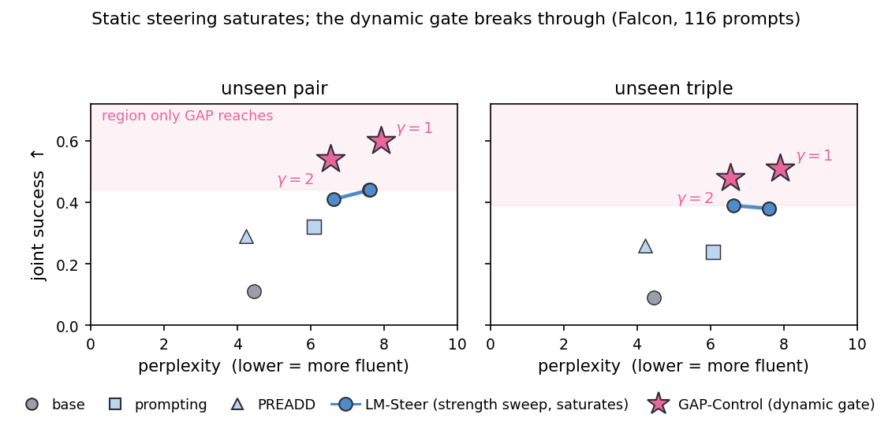
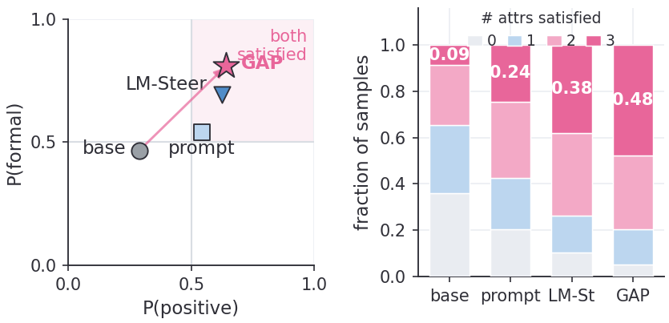
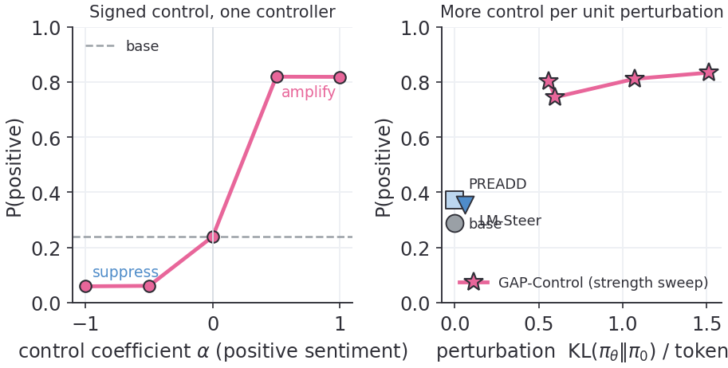
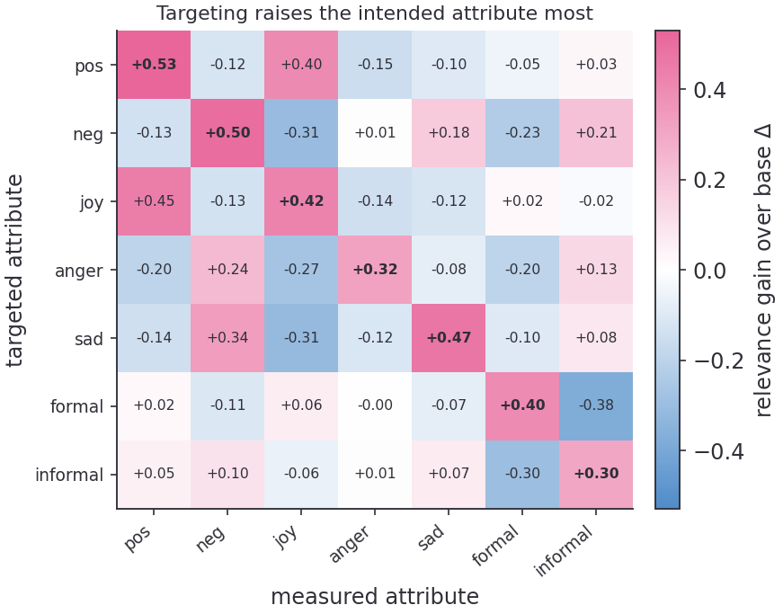
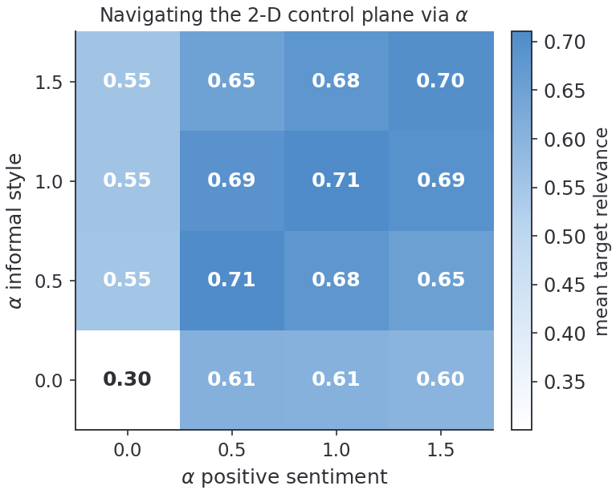

<div align="center">

# GAP-Control

### Cache Once, Compose Any — Amortized Compositional Controllable Decoding via a Shared-Rollout Advantage Cache


*One offline rollout pass caches every attribute's advantage. Any composition — seen, unseen, signed, or soft + hard — is then an exact linear combination, served by a single lightweight controller at about 1× base decoding cost.*

</div>

---

## TL;DR

Real controllable-generation requests are **compositions**: *"positive, formal, short, mentions ocean."* The space of such requests is combinatorial, and the interesting ones are mixtures that were **never trained or searched for**.

- **Amortized steering** (e.g. LM-Steer) is cheap — one forward pass — but composes by *adding* separately trained vectors, which is not reward-optimal and **saturates** under composition.
- **Inference-time search** (FUDGE, SMC, controlled decoding) is reward-grounded but **re-runs per target**, so its cost grows with the number of compositions.

**GAP-Control** (*Gated Advantage Projection*) gets the reward-grounding of search at the single-pass cost of steering. The key observation: when the control reward is a linear mixture scored on **one shared rollout**, the base-policy token-level advantage is **exactly linear** in the mixture weights. So we cache every atomic advantage *once*, and every composition is a free linear combination at decode time.

---

## The key identity

The KL-regularized optimal one-step intervention is the reward-induced token-level **advantage**:

$$\pi^\star(v \mid s_t, c) \;\propto\; \pi_0(v \mid s_t)\,\exp\!\big(A_c(s_t,v)/\tau\big), \qquad \ell_t^\star = \ell_t^0 + A_c(s_t,\cdot)/\tau .$$

When the reward is a linear mixture $R_c = \sum_i \alpha_i R_i$ evaluated on the **same** continuation, linearity of expectation gives the exact decomposition:

$$A_c \;=\; \sum_i \alpha_i A_i , \qquad V_c^\star \;=\; \sum_i \alpha_i V_i^\star .$$

A **single** shared-rollout pass per prefix therefore caches the per-attribute advantages $\{A_i\}$ of **all** attributes at once, and the optimal residual for **any** condition $c=\{(a_i,\alpha_i)\}$ — including signed $\alpha_i<0$ (suppression) and soft + hard mixtures — is a linear combination of the cache, with no further rollout, training, or search. We call this **cache once, compose any**.

---

## Method: three stages

<div align="center">

<br><sub>The three stages in detail. <b>(1) Cache once</b>: one shared rollout per prefix scores every atomic reward on the same continuations → per-attribute advantage cache. <b>(2) Compose any</b>: any signed/scaled mixture is the exact linear combination $A_c=\sum_i\alpha_i A_i$. <b>(3) Amortize</b>: a single-pass controller emits the residual, the value-gap gate sizes it, and a hard-constraint overlay handles verifier-defined attributes.</sub>
</div>

**1 · Cache once** *(offline)* — From each prefix, one shared rollout set scores *every* atomic attribute reward on the *same* continuations, yielding the advantage cache

$$\hat A_i(s_t,v) = \hat Q_i(s_t,v) - \sum_{u\in S_t}\pi_0(u\mid s_t)\,\hat Q_i(s_t,u), \qquad \hat Q_i(s_t,v)=\tfrac1n\sum_{j} R_i(y^{(j)}).$$

**2 · Compose any** *(free)* — For any requested mixture, the optimal residual is $A_c/\tau = \sum_i \alpha_i \hat A_i / \tau$ by the identity above. The same cache covers seen, unseen, signed, and soft + hard compositions.

**3 · Amortize** *(online, one pass)* — A lightweight controller distills the cache, predicting a tied logit residual $b = W_{\mathrm{LM}}\,r_t$ and a value $\widehat V_t$ from the base hidden state and a control vector $v(c)=\sum_i \alpha_i e_i$. A **value-gap gate** sizes each step — intervene in proportion to how far the objective is from being met and how much head-room the base leaves:

$$\rho_t = \big(\rho_{\min} + \rho_{\max}\,g_t\big)\,u_t^{\gamma}, \qquad g_t = \max\!\big(0,\,R_{\text{target}} - \widehat V_t\big), \qquad u_t = 1 - \max_v \pi_0(v\mid s_t).$$

The controller supplies the direction, the gate the magnitude (centered, set-to-norm): $\;b_t = \rho_t\,\bar b / \lVert \bar b \rVert$. **Verifier-defined** attributes (length, keyword, structure) are met by a small separate overlay (EOS budget bias, satisfaction-gated marker push) — a few logit adds per step, no extra forward pass.

Online cost: **one base forward + one tiny controller forward per token** ($\approx 1\times$ base).

<div align="center">

<br><sub>The gate is adaptive, not a constant knob: the predicted value tracks final attribute relevance (left), and the intervention norm shrinks ~53% over decoding as the value gap closes (right).</sub>
</div>

---

## Results

On **base** (non-instruction-tuned) LMs, where prompting fails, GAP-Control leads decoding-time control on single *and* compositional attributes. Falcon3-3B-Base, 116 held-out prompts (zero training overlap), 95% prompt-clustered bootstrap CIs:

| Method | Rel. ↑ | Succ. ↑ | Seen pair | **Unseen pair** | **Unseen triple** | PPL ↓ | ×base |
|---|:--:|:--:|:--:|:--:|:--:|:--:|:--:|
| base | 0.29 | 0.27 | 0.15 | 0.11 | 0.09 | 4.46 | 1.0× |
| prompting | 0.42 | 0.40 | 0.35 | 0.32 | 0.24 | 6.08 | 1.0× |
| PREADD | 0.50 | 0.49 | 0.40 | 0.29 | 0.26 | 4.23 | 3.0× |
| FUDGE | 0.48 | 0.47 | 0.23 | 0.21 | 0.17 | 7.96 | 8.2× |
| LM-Steer *(tuned, rank-256)* | 0.76 | 0.77 | 0.50 | 0.44 | 0.38 | 7.60 | 2.0× |
| **GAP-Control** | **0.82** | **0.84** | **0.60** | **0.54** | **0.48** | 6.55 | **1.2×** |

- **Breaks the saturation ceiling.** Tuned LM-Steer's compositional control *saturates* (strength-6 and strength-12 coincide at 0.44 / 0.38); GAP-Control exceeds it at *any* operating point — and at **lower** perplexity.
- **The advantage widens with arity** (unseen pair → triple), exactly as the theory predicts: composition error is bounded by the per-atomic fit, not the number of co-active attributes.
- **One controller, every attribute.** Per-attribute relevance averages **0.73** across seven soft classes (vs. LM-Steer 0.63, prompting 0.44, base 0.31), and the *same* controller does signed suppression zero-shot ($P(\text{positive})$: 0.06 → 0.82 as $\alpha: -1 \to +1$).
- **Hard constraints** via the overlay: keyword **1.00**, length **0.98**, structure **0.89** (vs. prompting 0.47 / 0.63 / 0.32).

<div align="center">


<br><sub>Left: static steering <b>saturates</b> while GAP-Control reaches control it cannot match at any strength, and at lower PPL. Right: GAP-Control puts the most probability mass on satisfying <b>all</b> target attributes of an unseen pair / triple at once.</sub>
</div>

<div align="center">


<br><sub>Left: one controller spans <b>signed</b> control zero-shot — suppression ($\alpha=-1$) to amplification ($\alpha=+1$). Right: GAP-Control sits in the cheap-and-controllable corner — above inference-time search (FUDGE) on control, ~7× faster.</sub>
</div>

<div align="center">


<br><sub>Left: control is <b>specific</b> — targeting an attribute (row) raises that attribute most (diagonal), with leakage only between correlated attributes. Right: the two-coefficient control plane is a smooth, navigable knob — joint success rises as either weight increases.</sub>
</div>

---

## Controlled attributes

Two reward classes under one residual mechanism:

- **Soft** (classifier reward, continuous intensity): **sentiment** {positive, negative, neutral}, **emotion** {joy, anger, sadness, fear}, **style** {formal, informal, literary} — a `bge-base-en-v1.5` head trained on synthesized, judge-filtered text, then frozen.
- **Hard** (exact rule verifier, training-free): **length** {short / medium / long / target N}, **keyword** {required set}, **structure** {interrogative / exclamatory / enumeration / dialogue}.

A control condition is a list of `(attribute, weight)` components, so single-attribute, continuous-intensity, signed, and multi-attribute composition are all one code path.

---

## Setup

```bash
cp .env.example .env      # fill GAPCTRL_API_KEY / BASE_URL / MODEL (synthesis & LLM-judge only)
pip install torch transformers scikit-learn pyyaml numpy
```

Local models are read from `GAPCTRL_MODELS_DIR` (base LM, `bge-base-en-v1.5` backbone); runs are offline by default (`HF_HUB_OFFLINE=1`). The API is needed **only** to synthesize classifier data and run the LLM-judge — decoding and evaluation are fully local.

## Quickstart

```bash
# fast end-to-end smoke test
bash scripts/run_mvp.sh configs/sentiment_smoke.yaml

# compositional control (cache → train → decode), with baselines
python scripts/estimate_teacher_multi.py --config configs/compositional_demo.yaml   # 1. shared-rollout cache
python scripts/train_compositional.py    --config configs/compositional_demo.yaml   # 2. distill controller
python scripts/decode_gap_control.py     --config configs/compositional_demo.yaml \
       --methods gap,prompt,preadd,fudge                                            # 3. decode + baselines
python scripts/evaluate.py               --config configs/compositional_demo.yaml   # 4. metrics table
```

## Repository layout

```
gap_control/         core library
  attributes.py        registry, ControlCondition, reward mixture R_c (soft + hard)
  teacher.py           shared-rollout teacher: Q → centered advantage A, value target V*
  controller.py        control encoder (attribute-slot mixture) + gated controller (r_t, V̂)
  projection.py        center + value-gap gate (the magnitude budget)
  decoding.py          GAP-Control decode + prompting / FUDGE / best-of-N baselines
  classifiers.py       soft attributes: bge head + classifier bank
  verifiers.py         hard attributes: length / keyword / structure (exact, offline)
  rewards.py           wires classifiers / verifiers / judge into R_c
  synth.py judge.py    LLM-API synthetic data generation + judge filtering
  base_lm.py metrics.py config.py env.py
scripts/             pipeline CLIs (cache · train · decode · evaluate · synth)
configs/             experiment configs
data/                small canonical inputs (prompts, rewards); large rollouts gitignored
```

## Citation

```bibtex
@inproceedings{gapcontrol,
  title     = {Cache Once, Compose Any: Amortized Compositional Controllable
               Decoding via a Shared-Rollout Advantage Cache},
  author    = {Anonymous},
  year      = {2027}
}
```
